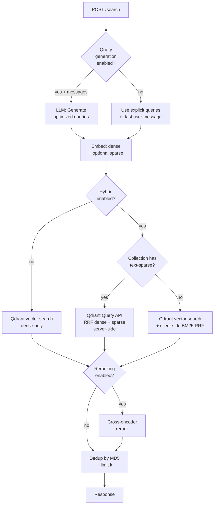
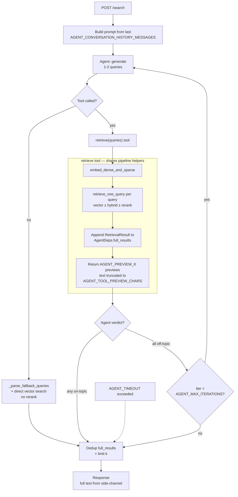

# Agentic Retrieval Service

Agentic retrieval microservice for [Open WebUI](https://github.com/open-webui/open-webui). Wraps RAG document search in
an LLM-driven reasoning loop — adding query rewriting, decomposition, and corrective relevance grading with retry. Falls
back to a traditional linear pipeline when agentic mode is disabled.

Uses [PydanticAI](https://ai.pydantic.dev/) for the agent loop. Retrieval services (embedding, Qdrant, BM25, reranking)
remain as direct custom code exposed as PydanticAI tools. Agent LLM calls route through the existing LiteLLM proxy in
the parent stack.

Integrates with Open WebUI via its external retrieval API — configure `RAG_EXTERNAL_RETRIEVAL_API_KEY` and point it at
this service.

## Requirements

- Docker and Docker Compose
- [Task](https://taskfile.dev/) (Go Task runner)
- Access to a Qdrant instance (shared with Open WebUI)
- An OpenAI-compatible embedding endpoint matching Open WebUI's RAG config
- *(For agentic mode or query generation)* An LLM endpoint (e.g. LiteLLM proxy)

## Quick Start

### Local Development (Docker Compose + [Task](https://taskfile.dev/))

```shell
cp .env.example .env
# Edit .env — at minimum set API_KEY and verify QDRANT_URI and embedding settings

# Generate a secure API key:
python -c "import secrets; print(secrets.token_urlsafe(32))"
# Set the output as API_KEY in .env and as RAG_EXTERNAL_RETRIEVAL_API_KEY in Open WebUI

task setup          # starts containers + installs dev deps (requires Traefik 'frontend' network)
task logs           # tail retrieval container logs
```

Common task commands:

```shell
task up             # start containers
task down           # stop containers
task shell          # open bash shell in the retrieval container
task install        # reinstall deps (pip install '.[dev]')
task lint           # run all linters (ruff check + format --check)
task lint:fix       # auto-fix lint issues
task test           # run all tests (pytest -v)
task test:coverage  # run tests with coverage report
task ci             # lint + test
```

Run a single test:

```shell
docker compose exec retrieval pytest tests/services/test_agent.py -v
docker compose exec retrieval pytest tests/services/test_agent.py::TestAgenticSearch::test_empty_queries -v
```

### Production Image

```shell
task build:image              # build + push to ghcr.io/aarhusai/retrieval-agent:latest
task build:image TAG=v1.0.0   # with specific tag
```

### Standalone Docker (without Compose)

```shell
docker build -t agentic-retrieval .
docker run --env-file .env -p 8000:8000 agentic-retrieval
```

The service exposes two health endpoints:

- `GET /health` — liveness probe (always returns 200 if the process is running)
- `GET /health/ready` — readiness probe (verifies Qdrant connectivity, returns 503 if unreachable)

## API

### `POST /search`

Requires `Authorization: Bearer <API_KEY>` header.

**Request (with explicit queries):**

```json
{
  "queries": [
    "what is the policy on remote work?"
  ],
  "collection_names": [
    "file-abc123",
    "knowledge-base"
  ],
  "k": 5
}
```

**Request (with chat messages — the service generates optimized queries):**

```json
{
  "messages": [
    { "role": "user", "content": "Tell me about remote work" },
    { "role": "assistant", "content": "We have several policies..." },
    { "role": "user", "content": "What about the approval process?" }
  ],
  "collection_names": [
    "file-abc123",
    "knowledge-base"
  ],
  "k": 5,
  "retrieval_query_generation_prompt_template": "optional custom template override"
}
```

At least one of `queries` or `messages` must be provided. When `messages` is given, the service extracts or generates
search queries from the conversation (via LLM when `ENABLE_QUERY_GENERATION=true` or in agentic mode, otherwise falls
back to the last user message).

**Response:**

```json
{
  "documents": [
    [
      "Document text 1",
      "Document text 2"
    ]
  ],
  "metadatas": [
    [
      {
        "source": "..."
      },
      {
        "source": "..."
      }
    ]
  ],
  "distances": [
    [
      0.87,
      0.82
    ]
  ]
}
```

Each top-level list element corresponds to one query. `distances` are normalized to `[0, 1]` (higher = more similar).

## Configuration

All settings are environment variables (or `.env` file). See [`.env.example`](.env.example) for the full list.

| Variable                              | Default                                       | Description                                                                                                  |
|---------------------------------------|-----------------------------------------------|--------------------------------------------------------------------------------------------------------------|
| `API_KEY`                             | *(required)*                                  | Must match `RAG_EXTERNAL_RETRIEVAL_API_KEY` in Open WebUI                                                    |
| `QDRANT_URI`                          | `http://qdrant:6333`                          | Qdrant connection URL                                                                                        |
| `QDRANT_API_KEY`                      |                                               | Qdrant API key (if authentication is enabled)                                                                |
| `QDRANT_INDEX`                        | `ingestion_files`                             | Single physical Qdrant collection written by the ingestion service                                           |
| `EMBEDDING_MODEL`                     | `intfloat/multilingual-e5-large`              | Must match the embedding model the ingestion service used at index time                                      |
| `EMBEDDING_API_BASE_URL`              |                                               | OpenAI-compatible embedding endpoint                                                                         |
| `EMBEDDING_API_KEY`                   |                                               | API key for embedding endpoint                                                                               |
| `EMBEDDING_PREFIX_QUERY`              | `query: `                                     | Query-side prefix (must match what ingestion used; e.g. `"query: "` for e5, empty for bge-m3)                |
| `ENABLE_HYBRID_SEARCH`                | `false`                                       | Enable hybrid retrieval — native sparse+dense (when collection has `text-sparse`) or BM25 fallback otherwise |
| `HYBRID_BM25_WEIGHT`                  | `0.3`                                         | BM25 weight in the client-side BM25 fallback fusion (vector weight = 1 − this; unused on the native path)    |
| `BM25_CACHE_TTL_SECONDS`              | `300`                                         | TTL for the client-side BM25 index cache (only consulted on the fallback path)                               |
| `SPARSE_QUERY_PROVIDER`               | `fastembed`                                   | `fastembed` runs a sparse model in-process; `none` disables sparse and forces dense-only on the native path  |
| `SPARSE_QUERY_MODEL`                  | `Qdrant/bm42-all-minilm-l6-v2-attentions`     | Must match the sparse model the ingestion service used for indexing                                          |
| `ENABLE_RERANKING`                    | `false`                                       | Enable cross-encoder reranking stage                                                                         |
| `RERANKER_MODEL`                      | `cross-encoder/ms-marco-MiniLM-L-6-v2`        | Cross-encoder model for reranking                                                                            |
| `RERANKER_API_BASE_URL`               |                                               | OpenAI-compatible reranker endpoint (e.g. `https://embed.itkdev.dk`)                                         |
| `RERANKER_API_KEY`                    |                                               | API key for reranker endpoint                                                                                |
| `INITIAL_RETRIEVAL_MULTIPLIER`        | `3`                                           | Fetch k × multiplier candidates before reranking (linear pipeline)                                           |
| `ENABLE_QUERY_GENERATION`             | `true`                                        | Enable LLM-based query generation from chat messages (linear pipeline only)                                  |
| `ENABLE_AGENTIC_RAG`                  | `false`                                       | Route to the agentic pipeline (LLM-driven retrieval loop) instead of the linear one                          |
| `AGENT_MODEL`                         | `gpt-4o-mini`                                 | LLM model for agent decisions and query generation                                                           |
| `AGENT_API_BASE_URL`                  | `http://litellm:4000/v1`                      | LLM endpoint for agent (defaults to LiteLLM proxy)                                                           |
| `AGENT_API_KEY`                       |                                               | API key for agent LLM endpoint                                                                               |
| `AGENT_MAX_ITERATIONS`                | `3`                                           | Max retry iterations within the agent loop                                                                   |
| `AGENT_TOOL_PREVIEW_CHARS`            | `200`                                         | Max chars of document text sent to the agent for grading (full text stored side-channel)                     |
| `AGENT_STRICT_TOOLS`                  | `true`                                        | Strict PydanticAI tool definitions (disable for models that don't support strict tool schemas)               |
| `AGENT_TIMEOUT`                       | `60`                                          | Wall-clock timeout (seconds) for the agent run — returns partial results on timeout                          |
| `AGENT_SYSTEM_PROMPT`                 |                                               | Override the default agent system prompt (uses built-in prompt when empty)                                   |
| `AGENT_FETCH_K`                       | `20`                                          | Internal per-query candidate pool size; decoupled from `request.k` so a small `top_k` doesn't starve grading |
| `AGENT_PREVIEW_K`                     | `5`                                           | Max previews returned to the agent per `retrieve` call (caps context-window pressure across iterations)      |
| `AGENT_CONVERSATION_HISTORY_MESSAGES` | `4`                                           | How many trailing chat messages to include verbatim in the agent's user prompt                               |
| `DEBUG`                               | `false`                                       | Enable debug logging (includes per-step token usage for agent and query generation)                          |
| `HOST`                                | `0.0.0.0`                                     | Server bind address                                                                                          |
| `PORT`                                | `8000`                                        | Server port                                                                                                  |

### Critical: Keeping Settings in Sync

The service has no schema discovery — these settings are contracts with the **ingestion service** that writes the
Qdrant index. Mismatch produces silently-wrong results (garbage similarity scores, empty hits) rather than errors:

- **`QDRANT_INDEX`** — must name the same physical collection the ingestion service writes to.
- **`EMBEDDING_MODEL` + `EMBEDDING_PREFIX_QUERY`** — must match what ingestion used at index time. The prefix is
  applied to the query before embedding (e.g. e5 uses `"query: "` on queries and `"passage: "` on documents — keep
  the trailing space).
- **`SPARSE_QUERY_MODEL`** — only matters when the collection carries a `text-sparse` vector. Must match the model
  ingestion used for sparse indexing, otherwise the native hybrid path returns noise.
- **Qdrant instance** — must point at the same Qdrant the ingestion service writes to.

## Search Pipeline

### Linear Mode (`ENABLE_AGENTIC_RAG=false`)



1. **Query resolution** — when `messages` are provided and `ENABLE_QUERY_GENERATION=true`, an LLM generates optimized
   retrieval queries from the conversation. Otherwise uses explicit `queries` or falls back to the last user message.
2. **Embed** — dense via the configured embedding API; sparse via in-process `fastembed` only when hybrid is enabled
   *and* the configured collection has a `text-sparse` named vector (capability probed once at startup, cached).
3. **Retrieve** — a single Qdrant call per query, filtered by `meta.collection_name ∈ collection_names`. The hybrid
   path branches by collection capability: native server-side RRF when sparse is present, client-side BM25 RRF as a
   fallback when it isn't.
4. **Reranking** *(optional)* — cross-encoder rescores top `k × INITIAL_RETRIEVAL_MULTIPLIER` candidates down to `k`.
5. **Dedup** by content hash (MD5), limit to `k` per query. The response shape is one document list per query.

### Agentic Mode (`ENABLE_AGENTIC_RAG=true`)



The agent is a tool-calling loop, not a multi-stage planner. The system prompt tells it to generate 1-2 queries,
call `retrieve` once, ACCEPT if *any* returned document is on-topic, and only RETRY with rewritten queries when
the results are completely off-topic.

1. **Prompt building** — the last `AGENT_CONVERSATION_HISTORY_MESSAGES` messages are inlined into the agent's user
   prompt so it can resolve conversational references ("the one you mentioned").
2. **Retrieve tool** — the same pipeline helpers (`embed_dense_and_sparse`, `retrieve_one_query`) used by linear
   mode. Hybrid + rerank branches are identical; the agent path just feeds them through a side-channel.
3. **Side-channel** — `AgentDeps.full_results` accumulates the *full* `RetrievalResult` lists across iterations.
   The tool only returns truncated previews (`AGENT_PREVIEW_K` items, `AGENT_TOOL_PREVIEW_CHARS` per item) to the
   LLM, so the agent's context window doesn't balloon across retries.
4. **Fallback** — if the agent emits queries as text instead of calling the tool, `_parse_fallback_queries` extracts
   them (plain JSON or Mistral `[TOOL_CALLS]` syntax) and runs a direct vector search; rerank is intentionally
   skipped on this path.
5. **Timeout** — `AGENT_TIMEOUT` is wall-clock. On timeout, whatever the tool already wrote to `full_results` is
   returned (partial results, not 500s).
6. **Dedup** by content hash across all accumulated results, limit to `k`. The response uses full text from the
   side-channel, not the truncated previews the agent saw.

### Notes

- The client-side BM25 fallback scrolls the filtered Qdrant content into memory — only practical when the
  collection-name filter narrows the set substantially. Results are cached by sorted-tuple-of-collection-names for
  `BM25_CACHE_TTL_SECONDS` (default 5 min). The native sparse+dense path doesn't touch this code.
- When reranking is enabled (linear mode), the initial fetch is `k × INITIAL_RETRIEVAL_MULTIPLIER`. In agentic mode
  the per-query candidate pool is `AGENT_FETCH_K` instead, decoupled from `request.k`.
- Agentic mode adds 2–5× latency and 2–4× token cost per query. Use a fast, cheap model (e.g. GPT-4o-mini) for
  agent decisions.
- Agent LLM calls default to the LiteLLM proxy at `http://litellm:4000/v1`, making provider switching a config change.
