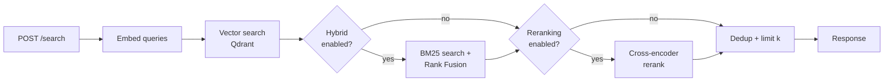
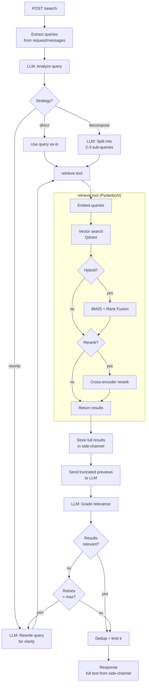

# Agentic Retrieval Service

> **Replaces `retrieval-service`**

Agentic retrieval microservice for [Open WebUI](https://github.com/open-webui/open-webui). Wraps RAG document search in an LLM-driven reasoning loop — adding query rewriting, decomposition, and corrective relevance grading with retry. Falls back to a traditional linear pipeline when agentic mode is disabled.

Uses [PydanticAI](https://ai.pydantic.dev/) for the agent loop. Retrieval services (embedding, Qdrant, BM25, reranking) remain as direct custom code exposed as PydanticAI tools. Agent LLM calls route through the existing LiteLLM proxy in the parent stack.

Integrates with Open WebUI via its external retrieval API — configure `RAG_EXTERNAL_RETRIEVAL_API_KEY` and point it at this service.

## Requirements

- Python 3.11+
- Access to a Qdrant instance (shared with Open WebUI)
- An OpenAI-compatible embedding endpoint matching Open WebUI's RAG config
- *(For agentic mode)* An LLM endpoint for agent decisions (e.g. LiteLLM proxy)

## Quick Start

### Local Development

```shell
cp .env.example .env
# Edit .env — at minimum set API_KEY and verify QDRANT_URI and embedding settings

# Generate a secure API key:
python -c "import secrets; print(secrets.token_urlsafe(32))"
# Set the output as API_KEY in .env and as RAG_EXTERNAL_RETRIEVAL_API_KEY in Open WebUI

pip install .
python -m uvicorn app.main:app --host 0.0.0.0 --port 8000 --reload
```

### Docker

```shell
docker build -t agentic-retrieval .
docker run --env-file .env -p 8000:8000 agentic-retrieval
```

The service exposes a healthcheck at `GET /health`.

## API

### `POST /search`

Requires `Authorization: Bearer <API_KEY>` header.

**Request:**

```json
{
  "queries": ["what is the policy on remote work?"],
  "collection_names": ["file-abc123", "knowledge-base"],
  "k": 5
}
```

**Response:**

```json
{
  "documents": [["Document text 1", "Document text 2"]],
  "metadatas": [[{"source": "..."}, {"source": "..."}]],
  "distances": [[0.87, 0.82]]
}
```

Each top-level list element corresponds to one query. `distances` are normalized to `[0, 1]` (higher = more similar).

## Configuration

All settings are environment variables (or `.env` file). See [`.env.example`](.env.example) for the full list.

| Variable | Default | Description |
|----------|---------|-------------|
| `API_KEY` | *(required)* | Must match `RAG_EXTERNAL_RETRIEVAL_API_KEY` in Open WebUI |
| `QDRANT_URI` | `http://qdrant:6333` | Qdrant connection URL |
| `QDRANT_MULTITENANCY` | `true` | Must match Open WebUI's multitenancy setting |
| `QDRANT_COLLECTION_PREFIX` | `open-webui` | Must match Open WebUI's collection prefix |
| `EMBEDDING_MODEL` | `intfloat/multilingual-e5-large` | Must match Open WebUI's RAG embedding model |
| `EMBEDDING_API_BASE_URL` | | OpenAI-compatible embedding endpoint |
| `EMBEDDING_QUERY_PREFIX` | `query: ` | Prefix applied to queries before embedding |
| `ENABLE_HYBRID_SEARCH` | `false` | Enable BM25 + vector Reciprocal Rank Fusion |
| `HYBRID_BM25_WEIGHT` | `0.3` | BM25 weight in fusion (vector weight = 1 - this) |
| `ENABLE_RERANKING` | `false` | Enable cross-encoder reranking stage |
| `RERANKER_MODEL` | `cross-encoder/ms-marco-MiniLM-L-6-v2` | Cross-encoder model for reranking |
| `INITIAL_RETRIEVAL_MULTIPLIER` | `3` | Fetch k × multiplier candidates before reranking |
| `ENABLE_AGENTIC_RAG` | `false` | Enable agentic mode (LLM-driven query analysis, rewriting, grading) |
| `AGENT_MODEL` | `gpt-4o-mini` | LLM model for agent decisions |
| `AGENT_API_BASE_URL` | `http://litellm:4000/v1` | LLM endpoint for agent (defaults to LiteLLM proxy) |
| `AGENT_API_KEY` | | API key for agent LLM endpoint |
| `AGENT_MAX_ITERATIONS` | `3` | Max corrective RAG retry iterations |
| `AGENT_TOOL_PREVIEW_CHARS` | `200` | Max chars of document text sent to agent LLM for grading (full text stored separately) |

### Critical: Keeping Settings in Sync

The following settings **must** match your Open WebUI deployment exactly, or search results will be incorrect:

- **Embedding model and query prefix** — mismatched embeddings produce meaningless similarity scores
- **Qdrant collection prefix and multitenancy mode** — the service replicates Open WebUI's collection-routing logic internally
- **Qdrant instance** — must point at the same Qdrant that Open WebUI writes to

## Search Pipeline

### Linear Mode (`ENABLE_AGENTIC_RAG=false`)



1. **Embed** queries using the configured embedding API
2. **Vector search** across all requested collections concurrently via Qdrant
3. **Hybrid fusion** *(optional)*: BM25 keyword search fused with vector results using Reciprocal Rank Fusion
4. **Reranking** *(optional)*: cross-encoder model rescores the top candidates
5. **Dedup** by content hash, limit to `k` results

### Agentic Mode (`ENABLE_AGENTIC_RAG=true`)



1. **Query Analysis** — LLM decides strategy: direct search, rewrite for clarity, or decompose into sub-queries
2. **Query Rewriting** — LLM reformulates vague queries for better retrieval
3. **Query Decomposition** — complex questions split into independent sub-queries
4. **Retrieval** — existing pipeline (embed → vector search → optional hybrid/rerank) exposed as a PydanticAI tool
5. **Side-channel** — full document text stored in deps; only truncated previews (`AGENT_TOOL_PREVIEW_CHARS`) sent to the LLM to reduce token cost
6. **Relevance Grading** — LLM grades truncated results; if poor, rewrites query and retries (up to `AGENT_MAX_ITERATIONS`)
7. **Dedup** by content hash, limit to `k` results — response uses full text from the side-channel

### Notes

- BM25 hybrid search scrolls entire collections from Qdrant per query — only practical for small collections.
- When reranking is enabled, the initial retrieval fetches `k × INITIAL_RETRIEVAL_MULTIPLIER` candidates to give the reranker a larger pool.
- Agentic mode adds 2–5× latency and 2–4× token cost per query. Use a fast, cheap model (e.g. GPT-4o-mini) for agent decisions.
- Agent LLM calls default to the LiteLLM proxy at `http://litellm:4000/v1`, making provider switching a config change.
